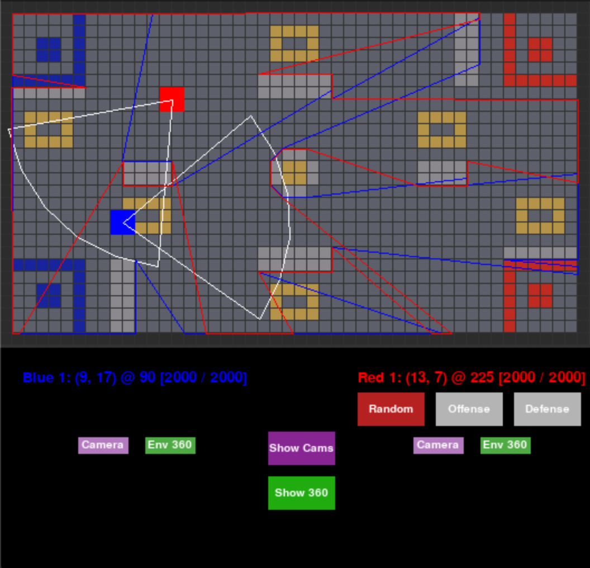
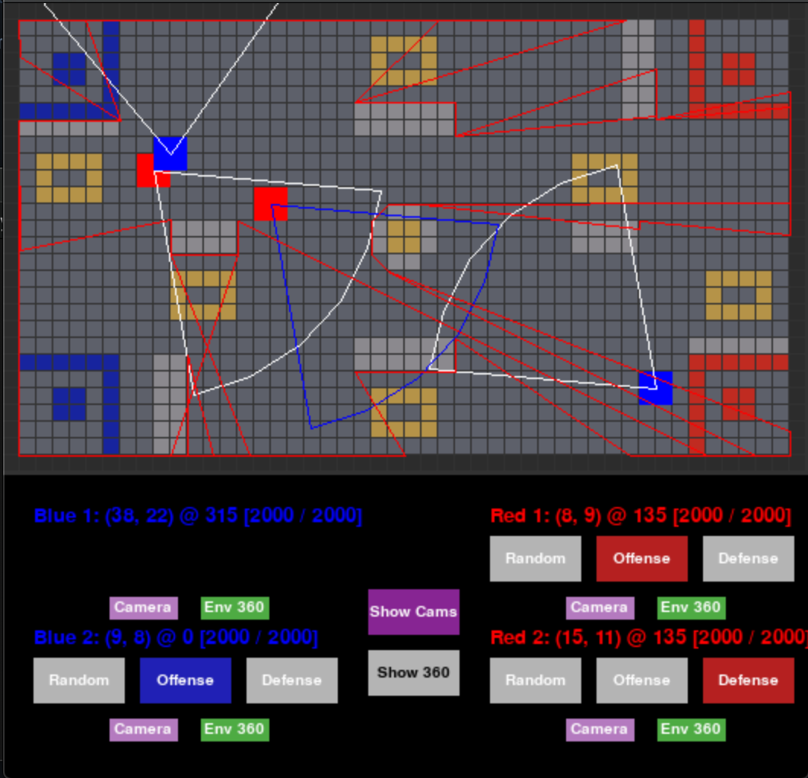

# RoboMasterAI PyGame Simulation
#### M Charity and Catalina Jaramillo
Computational Geometry 2021 project implementing the art gallery guard algorithm for RoboMasterAI Competition 

## Background
---

### Purpose
RoboMaster University AI Challenge[1](https://www.robomaster.com/en-US/robo/icra) is a competition that offers students the opportunity to develop capabilities in the robotics field. The competition consists of an autonomous robot shooting confrontation and requires tasks like motion planning and control, computer vision, etc.
NYU has a team preparing to participate in the competition, and we will be providing them with some tools for the battle. [3](https://wp.nyu.edu/nyurm/the-competition/)

### Art Gallery Problem
The art gallery problem is a computational geometry visibility problem that aims to find the smallest number of guards possible to cover an "art gallery" polygon with n vertices. [2](https://math.mit.edu/~apost/courses/18.204_2018/Nicole_Chesnokov_paper.pdf) We will be demonstrating an example of the art gallery problem in a dynamically changing situation (where the robots are constantly changing position) for the RoboMaster AI challenge. The robots (the guards) will locate themselves on the arena (the art gallery) as well as other robots (art thiefs). 

### Project Description
We built a simulation environment that reflects the arena and the movements of the robots in it. The environment can handle between 2-4 robots with 1 or more of the robots being AI controlled or and a single robot being player controlled.

Some tasks required for the competition that are implemented in this demo include:
1. Simulate the game arena and layout to be interpreted by an artificially intelligent program capable of making decisions without human input.
2. Identify the position of enemies.
3. Calculate the shortest path to a point where the enemy is visible
4. Calculate offensive positioning to find line-of-sight search for the opposing teams' robots

For an enemy to be within sight of the robot, it has to be in both the camera cone of the robot and the 360˚ visibility polygon given by the position of the robot in the arena; is such case, the robot could also be seen by the enemy, based on the direction where its camera cone is headed. In case the robot is in the 360˚ visibility polygon but not in the camera cone, the robot wont see the enemy but, again, the enemy may see the robot, depending on the camera direction. In any case where the enemy is out of the robot's 360˚ visibility polygon, it will be out of robot's sight (independent of the camera direction).

5. Calculate defensive positioning to avoid the line-of-sight of the opposing teams' robots

For the offensive strategy, the enemy's 360˚ visibility polygon comes into play. Using Breadth-first search (BFS), the robot will look for the closest location in the arena that is out of the enemy's 360˚ visibility polygon and move towards such point.

### Project Deliverables

All of these programs will be written in the Python language using the [PyGame](https://www.pygame.org/docs/) and [VisiLibity](https://karlobermeyer.github.io/VisiLibity1/) libraries. The result will be a program with an interactive user-interface that will allow automated actions as well as direct user input to control the simulated robots in the game.  

* A simulated environment of the arena defined in the competition manual
* A path-finding algorithm
* An algorithm capable of determining best positioning in the arena; similar to the Art Gallery problem of placing guards in appropriate areas

## Code
---
### Requirements (can be installed with `pip install -m requirements.txt`)
* Python 3+
* PyGame
* VisiLibity (and possibly [swig](https://github.com/swig/swig/wiki/Getting-Started))
* Numpy

### Running simulation
To run the simulation, navigate to 'src/' and run `python simulation.py`. 
The number of robots can in the game be set by modifying the variable `NUM_ROBOTS` to a value between 2-4
The first blue robot can be controlled with player input:
* **Arrow Keys** = move robot
* **Z** = turn camera left
* **X** = turn camera right

AI Robot behaviors can be changed by clicking between the following
* **Random** - the robot will move to a random place on the map
* **Offense** - if an enemy robot is seen within its camera cone and visibility mapping, the robot will move to the enemy's last seen location (and attack if within range)
* **Defense** - if within the 360 visibility of an enemy robot, the robot will move to the nearest hiding spot that is at least 10 cells away from its current location

Toggle individual onscreen camera visibilities by clicking the 'Camera' button under each robot or by clicking 'Show/Hide Camera' for all robots. 

### Files
* **[Simulation.py](src/simulation.py)** - contains the main game loop, ui, and robot behavior updates
* **[Robot.py](src/robot.py)** - contains all of the behavior definitions, properties, and visibility update functions for the robots in the game
* **[Camera.py](src/camera.py)** - defines the polygon creation for the camera visibility cone and 360 visibility mapping for the robots
* **[Arena_builder.py](src/arena_builder.py)** - manually creates the RoboMaster AI Challenge arena asdefined in the user manual as an interpretable polygon. Scaled down for simulation usage.

### Simulation Limitations
* *Pathfinding delay* - The simulation code and the robot pathfinding algorithms are run in the same file. The BFS pathfinding is executed everytime a robot reaches its destination and will occassionally pause the entire simulation in order to calculate the path to the next point. To minimize this time delay, a random point within 20 cells is calculated for the next destination instead of anywhere on the map
* *360 visibility* - In order to reduce the simulation delay from calculating the polygon that needs to be created to account for the change of position in the robot, the 360 visibility of each robot is only calculated every 4th step (20 ticks) in game. As such, there may appear to be some delay in the robot behaviors if set to offense or defense (i.e. a robot right in front of another robot may not be immediately detected)
* *Arena Scaling* - The dimensionality of the actual arena from the RoboMasterAI Challenge was vastly reduced to simplify the geometric calculations done by the robots as well as reduce the BFS pathfinding searches. This also helped with 2d grid mapping for PyGame. As such, this simulation is an extremely simplified version of the actual arena.
* *Robot collisions* - There is no check for if a robot collides with another robot, however, there is arena collision checking

